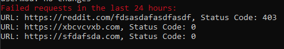

Тестовое задание backend yii2
------------
### Схема базы данных ([m230913_064525_create_url_requests_table.php](migrations%2Fm230913_064525_create_url_requests_table.php))
```php
return [
        $this->createTable('{{%url_requests}}', [
            'hash_string' => $this->string(32)->notNull()->comment('MD5 hash of the URL'),
            'created_at' => $this->timestamp()->defaultExpression('CURRENT_TIMESTAMP'),
            'updated_at' => $this->timestamp()->defaultExpression('CURRENT_TIMESTAMP'),
            'url' => $this->text()->notNull(),
            'status_code' => $this->smallInteger()->notNull(),
            'query_count' => $this->integer()->defaultValue(1),
            'failed_attempts' => $this->integer()->defaultValue(0)->comment('The number of failed attempts'),
            'is_disabled' => $this->boolean()->defaultValue(0),
        ]);
];
```
Добавлены поля: 

failed_attempts - количество неудачных попыток

is_disabled - состояние url (добавлено для задания 4.2)

### Инструкция по запуску

1. Переименовать .env.example -> .env
2. Запустить команду
~~~
docker-compose build
~~~
3. Запустить команду
~~~
docker-compose up -d
~~~
4. Запустить команду
~~~
docker-compose run --rm php yii migrate
~~~
Сервер доступен по 8080 порту ([docker-compose.yml](docker-compose.yml))

### Запуск консольной команды

~~~
docker-compose run --rm php yii check-status/statistics
~~~
Пример вывода:



### Дополнительные задачи

#### 4.1 Проверка кеша
Реализована в виде записей: hash_string - updated_at,
логика прописана в UrlController

#### 4.2 Команда для cron
Реализована в виде консольной команды [RetryFailedUrlsController.php](commands%2FRetryFailedUrlsController.php)
и выполняется каждый час(команда для кронтаба в Dockerfile)
